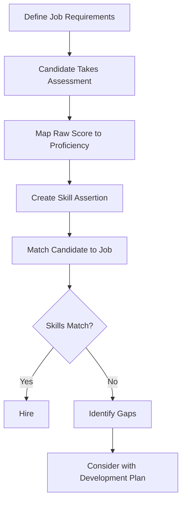

# HR Open Skills Data API - Postman Collection Guide

## Overview

This Postman collection implements the **HR Open Skills Data Workgroup JSON-LD Specification** (Pre-Release Feb 2026) for skills-based hiring, workforce transformation, and talent optimization.

## Table of Contents

1. [Quick Start](#quick-start)
2. [Core Concepts](#core-concepts)
3. [Collection Structure](#collection-structure)
4. [Workflows](#workflows)
5. [Best Practices](#best-practices)
6. [Standards Alignment](#standards-alignment)
7. [Integration Patterns](#integration-patterns)

---

## Quick Start

### Import Collection

1. Open Postman
2. Click **Import** → **Upload Files**
3. Select `Skills_API.postman_collection.json`
4. Click **Import**

### Configure Variables

1. Click on **HR Open Skills Data API** collection
2. Go to **Variables** tab
3. Set these values:
   - `base_url`: `https://api.hropen.org/skills/v1` (or your API endpoint)
   - `api_token`: Your authentication token
   - `organization_uri`: Your organization's URI (e.g., `https://organization.example.com`)

### Test the API

Try these requests:
1. **GET** `/skills` - List all skills
2. **GET** `/proficiency-scales` - View proficiency scales
3. **GET** `/assertions?personId=person-12345` - Get skill assertions

---

## Core Concepts

### 1. Skills as Shared Infrastructure

**Principle**: Skills are defined once, referenced everywhere

```
┌─────────────────────┐
│  Skill Definition   │  ← Central, reusable
│  (schema:Skill)     │
└─────────┬───────────┘
          │
          ├─→ Job Requirements (JEDx)
          ├─→ Worker Profiles
          ├─→ Assessments
          ├─→ Learning Programs
          └─→ Workforce Analytics
```

**Best Practice**: Never duplicate skill definitions. Reference existing skills by URI.

### 2. Separation of Concerns

The data model intentionally separates four layers:

| Layer | Purpose | Example |
|-------|---------|---------|
| **Skill** | The capability concept | "Go Programming Language" |
| **Assessment/Evidence** | Measurement | Score: 87/100 on certification exam |
| **Proficiency Level** | Interpreted capability | "Proficient" (level 4 of 5) |
| **Skill Assertion** | Business claim | "John has Proficient Go skills, valid 2025-2027" |

**Why this matters**:
- **Transparency**: Clear distinction between raw performance and interpreted capability
- **Fairness**: Standardized proficiency levels reduce bias
- **Auditability**: Evidence trail from assessment to hiring decision
- **Portability**: Skills assertions transfer across systems

### 3. JSON-LD First

All data uses **JSON-LD 1.1** for semantic clarity and interoperability.

```json
{
  "@context": "https://schema.org",
  "@type": "Skill",
  "@id": "https://api.hropen.org/skills/GO-PROGRAMMING",
  "name": "Go Programming Language"
}
```

**Benefits**:
- Global identifier resolution
- Semantic web integration
- Alignment with Open Badges, CLR, and credential standards
- Long-term data portability

---

## Collection Structure

### 📁 Skills (5 endpoints)

Manage skill definitions as shared infrastructure.

**Key Endpoints**:
- `GET /skills` - List all skills
- `GET /skills/:skillId` - Get skill details
- `POST /skills` - Create new skill
- `PUT /skills/:skillId` - Update skill
- `GET /skills/search` - Advanced search

**Best Practices**:
- Use stable, globally unique `@id` values
- Include `ctid` for Credential Engine alignment
- Use `codedNotation` for taxonomy mapping (ESCO, O*NET, Lightcast)
- Link to external taxonomies via `sameAs` or `isPartOf`
- Never embed proficiency or assessment data in skills

### 📁 Skill Assertions (5 endpoints)

Time-bound claims about skill proficiency with evidence.

**Key Endpoints**:
- `GET /assertions?personId=...` - Get assertions for person
- `POST /assertions` - Create assertion
- `GET /assertions/:assertionId` - Get assertion details
- `PATCH /assertions/:assertionId` - Update validity
- `DELETE /assertions/:assertionId` - Revoke assertion

**Best Practices**:
- Always include `validFrom` and `validUntil`
- **Never overwrite** assertions—create new ones for growth/change
- Preserve historical assertions for longitudinal analysis
- Include provenance (`source`, `assertedBy`)
- Link to assessment evidence when available

### 📁 Proficiency Scales (3 endpoints)

Normalized capability interpretation frameworks.

**Common Scales**:
- **3-level**: Basic, Intermediate, Advanced
- **4-level**: Foundational, Intermediate, Advanced, Expert
- **5-level**: Novice, Aspiring, Developing, Proficient, Advanced

**Key Endpoints**:
- `GET /proficiency-scales` - List all scales
- `GET /proficiency-scales/:scaleId` - Get scale details
- `POST /proficiency-scales` - Create custom scale

**Best Practices**:
- Use controlled vocabularies
- Govern proficiency scales centrally
- Keep scales consistent across hiring and workforce use cases
- Document mappings from raw scores to proficiency levels

### 📁 Assessment Integration (3 endpoints)

Map raw assessment scores to proficiency levels.

**Workflow**:
```
Assessment → Raw Score → Mapping Rules → Proficiency Level → Skill Assertion
```

**Key Endpoints**:
- `POST /assessments/map-to-proficiency` - Map score to proficiency
- `GET /assessments/mapping-rules` - Get documented mappings
- `POST /assessments/create-assertion` - Create assertion from assessment

**Example Mapping**:
```json
{
  "rawScore": 87,
  "mappingRules": [
    { "minScore": 0,  "maxScore": 49, "proficiencyLevel": "Novice" },
    { "minScore": 50, "maxScore": 69, "proficiencyLevel": "Developing" },
    { "minScore": 70, "maxScore": 89, "proficiencyLevel": "Proficient" },
    { "minScore": 90, "maxScore": 100, "proficiencyLevel": "Advanced" }
  ]
}
→ Result: "Proficient" (level 4)
```

### 📁 Workforce Analytics (5 endpoints)

Aggregate skills data for strategic insights.

**Key Endpoints**:
- `GET /analytics/skills-inventory` - Workforce skills distribution
- `POST /analytics/gap-analysis` - Skills gap analysis
- `POST /analytics/mobility-candidates` - Internal mobility matching
- `GET /analytics/trending` - Skills trending over time
- `GET /analytics/currency` - Skills currency/decay tracking

**Use Cases**:
- Workforce skill inventories
- Skill gap analysis
- Internal mobility and succession planning
- Learning investment optimization
- Proactive reskilling strategies

### 📁 JEDx Integration (4 endpoints)

Link skills to jobs, workers, and roles.

**Key Endpoints**:
- `GET /jedx/jobs/:jobId/skills` - Job requirements
- `PUT /jedx/jobs/:jobId/skills` - Set job requirements
- `POST /jedx/match` - Match candidate to job
- `GET /jedx/workers/:workerId/skills` - Worker skills profile

**Integration**: Seamless connection with HR Open JEDx API

### 📁 Credentials & Badges (2 endpoints)

Issue Open Badges and verifiable credentials.

**Standards**:
- IMS Global Open Badges v3.0
- W3C Verifiable Credentials
- Comprehensive Learner Record (CLR)

**Key Endpoints**:
- `POST /credentials/badges` - Issue skills badge
- `GET /credentials?personId=...` - Get learner credentials

### 📁 Taxonomies & Frameworks (3 endpoints)

Map skills to external taxonomies.

**Supported Taxonomies**:
- **ESCO** - European Skills/Competences/Qualifications
- **O*NET** - US Occupational Information Network
- **Lightcast** - Real-time labor market taxonomy
- **Internal** - Organization-specific frameworks

**Key Endpoints**:
- `GET /taxonomies` - List available taxonomies
- `POST /taxonomies/map` - Map skill to external taxonomy
- `GET /taxonomies/search` - Search external taxonomies

---

## Workflows

### Workflow 1: Skills-Based Hiring

**Scenario**: Hire a Senior Software Engineer



**Postman Requests**:

1. **Define Job Requirements**
   ```
   PUT /jedx/jobs/SWE-001/skills
   Body: SkillAssertionCollection with required skills
   ```

2. **Candidate Takes Assessment** (via HR Open Assessments API)
   ```
   External: Assessment administered
   Result: Raw score = 87/100 for "Go Programming"
   ```

3. **Map Raw Score to Proficiency**
   ```
   POST /assessments/map-to-proficiency
   Body: { rawScore: 87, skillId: "GO-PROGRAMMING", ... }
   Response: proficiencyLevel = "Proficient"
   ```

4. **Create Skill Assertion**
   ```
   POST /assessments/create-assertion
   Body: { personId, assessmentResultId, skillId, ... }
   Response: New assertion created
   ```

5. **Match Candidate to Job**
   ```
   POST /jedx/match
   Body: { candidateId: "person-12345", jobId: "SWE-001" }
   Response: matchScore = 0.85, gaps analysis
   ```

### Workflow 2: Workforce Skills Inventory

**Scenario**: Understand current engineering team capabilities

**Postman Requests**:

1. **Get Skills Inventory**
   ```
   GET /analytics/skills-inventory?department=Engineering&currentOnly=true
   Response: Distribution of 87 unique skills across 150 people
   ```

2. **Analyze Trending Skills**
   ```
   GET /analytics/trending?timeframe=6M&metric=growth&category=Technical
   Response: Cloud skills growing, legacy skills declining
   ```

3. **Skills Currency Check**
   ```
   GET /analytics/currency?threshold=1Y&department=Engineering
   Response: 23 people have skills expiring soon
   ```

4. **Gap Analysis for Future Needs**
   ```
   POST /analytics/gap-analysis
   Body: { targetRole: "Cloud Architect", currentPopulation: ... }
   Response: Missing skills, development recommendations
   ```

### Workflow 3: Internal Mobility

**Scenario**: Find internal candidates for Senior Backend Engineer role

**Postman Requests**:

1. **Define Target Role Requirements**
   ```
   GET /jedx/jobs/BACKEND-SENIOR-001/skills
   Response: Required skills with proficiency levels
   ```

2. **Find Mobility Candidates**
   ```
   POST /analytics/mobility-candidates
   Body: {
     targetRole: "BACKEND-SENIOR-001",
     requiredSkillMatch: 0.70,
     includeGrowthPotential: true
   }
   Response: 12 candidates with 70%+ match, ranked by fit
   ```

3. **For Each Candidate - Get Skills Profile**
   ```
   GET /jedx/workers/person-67890/skills
   Response: Current skills, proficiency levels, gaps vs. target
   ```

4. **Gap Analysis for Top Candidate**
   ```
   POST /analytics/gap-analysis
   Body: {
     targetRole: "BACKEND-SENIOR-001",
     currentPerson: "person-67890"
   }
   Response: 2 skill gaps, recommended 3-month development plan
   ```

### Workflow 4: Issue Skills Badge

**Scenario**: Award Open Badge for completing Go programming certification

**Postman Requests**:

1. **Assessment Completed** (via Assessments API)
   ```
   External: Candidate scores 87/100
   Result ID: result-789
   ```

2. **Create Skill Assertion**
   ```
   POST /assessments/create-assertion
   Body: { personId, assessmentResultId: "result-789", ... }
   Response: Assertion assertion-001 created
   ```

3. **Issue Open Badge**
   ```
   POST /credentials/badges
   Body: {
     credentialSubject: { id: "person-12345", achievement: ... },
     skillAssertion: { @id: "assertion-001" }
   }
   Response: Verifiable credential issued
   ```

4. **Verify Badge**
   ```
   GET /credentials?personId=person-12345&type=SkillBadge
   Response: List of all badges including new Go badge
   ```

---

## Best Practices

### Raw Scores vs. Proficiency Ratings

**Critical Distinction**:

| Element | Description | Example |
|---------|-------------|---------|
| **Raw Score** | Output from assessment | 87/100 points |
| **Proficiency Rating** | Interpreted capability | "Proficient" (level 4) |
| **Skill Assertion** | Business claim | "Advanced Go skills, valid 2025-2027" |

**Best Practices**:
1. **Retain raw scores** for transparency and auditability
2. **Document mapping rules** from scores to proficiency
3. **Never expose raw scores** directly in hiring decisions
4. **Store proficiency in assertions**, not raw scores
5. **Preserve assessment metadata** alongside assertions

### Time-Bounding Assertions

**Always include validity periods**:

```json
{
  "@type": "SkillAssertion",
  "validFrom": "2025-06-15T00:00:00Z",
  "validUntil": "2027-06-15T00:00:00Z"
}
```

**Benefits**:
- Track skill currency
- Identify skill decay
- Trigger proactive reskilling
- Support certification renewal

**Never overwrite assertions**. Instead:
```
❌ UPDATE assertion SET proficiency = "Advanced"
✅ INSERT new assertion with higher proficiency
```

### Provenance and Evidence

**Include source information**:

```json
{
  "evidence": [{
    "@type": "AssessmentResult",
    "@id": "https://api.hropen.org/assessments/results/result-789"
  }],
  "source": {
    "@type": "Organization",
    "@id": "https://organization.example.com"
  },
  "assertedBy": {
    "@type": "Person",
    "@id": "https://organization.example.com/people/manager-456"
  }
}
```

**Benefits**:
- Transparency
- Audit trail
- Verification
- Trust

### Skills Taxonomy Alignment

**Map to external taxonomies**:

```json
{
  "@type": "Skill",
  "@id": "https://api.hropen.org/skills/GO-PROGRAMMING",
  "sameAs": [
    "https://ec.europa.eu/esco/skill/12345",
    "https://services.onetcenter.org/ws/online/skills/2.A.1.a"
  ]
}
```

**Benefits**:
- Cross-organization portability
- Labor market alignment
- Interoperability
- Resume parsing compatibility

---

## Standards Alignment

This API aligns with multiple industry standards:

### IMS Global (1EdTech)
- **Open Badges v3.0**: Digital credentials for skills
- **Comprehensive Learner Record (CLR)**: Learning and employment history

### Credential Engine
- **CTDL**: Credential Transparency Description Language
- **CTID**: Unique credential identifiers

### IEEE
- **IEEE 1484.20.2-2022**: Defining Competencies
- **IEEE 1484.20.3-2023**: Sharable Competency Definitions
- **IEEE P2997**: Enterprise Learner Record

### HR Open Standards
- **JEDx API**: Job and employment data exchange
- **Assessments API**: Assessment results and scoring

### W3C
- **Verifiable Credentials**: Tamper-evident credentials
- **JSON-LD 1.1**: Linked data format

### Schema.org
- **Skill**: skill capability concept
- **SkillAssertion**: (proposed) skill claim
- **DefinedTerm**: proficiency levels
- **JobPosting**: job requirements

---

## Integration Patterns

### Pattern 1: HR Open Assessments API

**Flow**: Assessment → Skills API

```
1. Candidate completes assessment (Assessments API)
   POST /assessments/sessions/{sessionId}/complete

2. Retrieve raw score
   GET /assessments/results/{resultId}
   Response: { score: 87, maxScore: 100 }

3. Map to proficiency (Skills API)
   POST /skills/assessments/map-to-proficiency
   Response: { proficiencyLevel: "Proficient" }

4. Create assertion (Skills API)
   POST /skills/assertions
   Body: Link to assessment result as evidence
```

### Pattern 2: HR Open JEDx API

**Flow**: Jobs ↔ Skills API

```
1. Create job (JEDx API)
   POST /jedx/jobs

2. Define skills requirements (Skills API)
   PUT /skills/jedx/jobs/{jobId}/skills

3. Match candidates (Skills API)
   POST /skills/jedx/match
   Body: { candidateId, jobId }

4. Retrieve worker profile (JEDx + Skills)
   GET /jedx/workers/{workerId}
   GET /skills/jedx/workers/{workerId}/skills
```

### Pattern 3: Open Badges Ecosystem

**Flow**: Skills API → Credentials

```
1. Create skill assertion (Skills API)
   POST /skills/assertions

2. Issue Open Badge (Skills API)
   POST /skills/credentials/badges
   Body: References skill assertion

3. Export to wallet
   GET /skills/credentials?personId=...
   Format: W3C Verifiable Credential

4. Share/verify externally
   Third-party verifies via blockchain or hosted verification
```

---

## Example Requests

### Create a Skill

```http
POST {{base_url}}/skills
Content-Type: application/ld+json

{
  "@context": "https://schema.org",
  "@type": "Skill",
  "name": "Kubernetes Container Orchestration",
  "description": "Deploy, scale, and manage containerized applications using Kubernetes",
  "codedNotation": "K8S",
  "skillCategory": "Technical",
  "sameAs": [
    "https://ec.europa.eu/esco/skill/k8s-12345"
  ]
}
```

### Create a Skill Assertion

```http
POST {{base_url}}/assertions
Content-Type: application/ld+json

{
  "@context": [
    "https://purl.imsglobal.org/spec/ob/v3p0/context-3.0.3.json",
    "https://schema.org"
  ],
  "@type": "SkillAssertion",
  "skill": {
    "@type": "Skill",
    "@id": "https://api.hropen.org/skills/K8S"
  },
  "about": {
    "@type": "Person",
    "@id": "https://organization.example.com/people/person-12345"
  },
  "proficiencyLevel": {
    "@type": "DefinedTerm",
    "@id": "https://organization.example.com/proficiency/proficient"
  },
  "validFrom": "2026-02-03T00:00:00Z",
  "validUntil": "2028-02-03T00:00:00Z"
}
```

### Match Candidate to Job

```http
POST {{base_url}}/jedx/match
Content-Type: application/json

{
  "candidateId": "https://organization.example.com/people/person-12345",
  "jobId": "https://organization.example.com/jobs/DEVOPS-ENGINEER-001",
  "includeGapAnalysis": true,
  "weightByImportance": true
}
```

---

## Troubleshooting

### Common Issues

**401 Unauthorized**
- Check `api_token` in collection variables
- Verify token hasn't expired

**400 Bad Request - Invalid JSON-LD**
- Ensure `@context` is included
- Verify `@type` matches expected values
- Check all URIs are well-formed

**404 Skill Not Found**
- Verify skill `@id` exists
- Check you're using full URI, not just code

**Assertion Validation Failed**
- Include `validFrom` and `validUntil`
- Ensure proficiency level is in the referenced scale
- Link to existing skill via `@id`

### Validation

**Test JSON-LD validity**:
1. Copy response
2. Visit https://json-ld.org/playground/
3. Paste and validate

**Test Open Badges compliance**:
1. Export credential
2. Visit https://openbadges.org/validator/
3. Validate structure

---

## Additional Resources

- **HR Open Workgroup**: https://www.hropenstandards.org/
- **IMS Global Open Badges**: https://openbadges.org/
- **Credential Engine**: https://credentialengine.org/
- **Schema.org**: https://schema.org/
- **JSON-LD**: https://json-ld.org/

---

**Document Version**: 1.0.0
**API Version**: v1
**Last Updated**: 2026-02-03
**Postman Collection**: Skills_API.postman_collection.json
